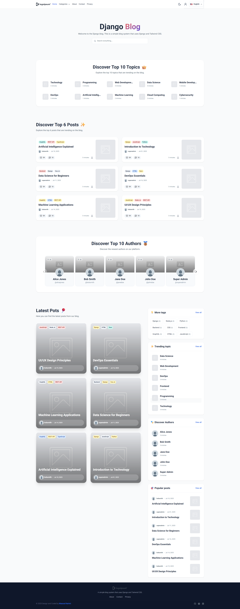

# Blogify

A Django-based web application for creating, managing, and sharing blog posts. Blogify offers a modern platform for multi-user blogging with rich content editing, multi-language
support, and a Dockerized deployment workflow.



---

## Features

- User authentication and registration (email-based login)
- Create, edit, and delete blog posts
- Rich text editor for posts (WYSIWYG)
- Categories and tags for organizing posts
- Comment system with moderation
- Multi-language support (English, Persian, Arabic)
- User profiles and avatars
- Search and filtering for posts
- Responsive UI (Django templates, Tailwind CSS)
- Admin dashboard for managing users, posts, and comments
- Static informational pages (About, Contact, Privacy)
- Jalali date support for Persian users
- Dockerized for easy deployment
- Nginx reverse proxy configuration

## Technology Stack

- **Backend:** Django 5.0
- **Database:** PostgreSQL (default), SQLite (for development)
- **Frontend:** Django Templates, HTML5, CSS3, Tailwind CSS
- **Containerization:** Docker, Docker Compose
- **Web Server:** Gunicorn, Nginx
- **Other Libraries:**
    - django-ckeditor (rich text editor)
    - django-rosetta (translation)
    - jdatetime (Jalali date support)
    - psycopg2 (PostgreSQL driver)
    - python-dotenv (env management)
    - redis (optional, for caching)

## Requirements

- Docker & Docker Compose (recommended)
- Or, for manual setup:
    - Python 3.10+
    - PostgreSQL (or SQLite for development)
    - pip (Python package manager)

## Quick Start (with Docker)

1. **Clone the repository:**
   ```bash
   git clone https://github.com/masoudkaarimi/django-mini-projects.git
   cd django-mini-projects/blogify
   ```
2. **Configure environment variables:**
    - Copy `.env.example` to `.env` and set your secrets (DB, Django, etc).
3. **Build and run the containers:**
   ```bash
   docker compose up --build
   ```
4. **Access the app:**
    - Web: http://localhost:8000
    - Admin: http://localhost:8000/admin/

## Manual Setup (without Docker)

1. Create and activate a virtual environment:
   ```bash
   cd src
   python -m venv venv
   # On Windows
   venv\Scripts\activate
   # On macOS/Linux
   source venv/bin/activate
   ```
2. Install Python dependencies:
   ```bash
   cd src
   pip install -r requirements.txt
   ```
3. Copy `.env.example` to `.env` and set your secrets (DB, Django, etc).
4. Run migrations, create a superuser, and load initial data:
   ```bash
   python manage.py migrate
   python manage.py createsuperuser
   python manage.py load_data   
   ```
5. Collect static files:
   ```bash
   python manage.py collectstatic
   ```
6. Run the development server:
   ```bash
   python manage.py runserver
   ```

## Docker Compose Services

- **django:** Main application (Gunicorn)
- **postgres:** Database
- **nginx:** Reverse proxy
- **redis:** (optional, for caching)

## Screenshots

See the [`screenshots/`](screenshots/) directory for UI examples.

## License

This project is licensed under the MIT License.
